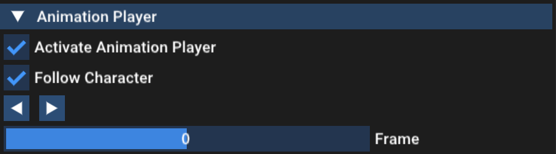

# Motion Matching for Responsive Animation For Digital Humans
For the course Digital Humans (2023 Spring) at ETH Zurich.

**Authors:**   
*Code base:* Dongho Kang  
*Motion Matching Implemeantation:* Matthias Karst, Xue Xian Lim, J. Pablo Paniagua H., Saatushan Sabesan

## How to use the program
1. The project (or `mocapApp`) has to be build  in cmake Release mode for realtime performance.

2. Run the `mocapApp`.

3. Click `Main Menu > Mocap Data > Import` button, and navigate to the bvh mocap data
   directory `data/mocap/lafan1_filtered_60fps`.
   Select the folder to import the all clips within the directory.

   

   Once the data imported successfully, a list of the motion data clip will appear in the `Mocap Data` menu.

   

4. Click play or press the spacebar to start the motion matching controller.
    

5. **Optional:** To instead inspect inspect a raw animation clip, activate the animation player in the menu bar. Then select a motion clip to play.
   

## Controls
The character can be controller either using a PlayStation 4 gamepad or with keyboard and mouse.
   
| Action      | Gamepad                  |  Keyboard & Mouse           |
| ----------- | ------------------------ | --------------------------- |
| Walking     | Left analog stick        | WASD                        |
| Camera      | Right analog stick       | Left Mousebutton + Drag     |
| Running     | Circle                   | Shift                       |
| Strafing    | L1                       | Alt/Option(Mac)             |

## UI
### Environment Settings
The environment settings allow to activate uneven terrain.
### Drawing Options
These options decide what will be rendered to see on screen. The Controller Trajectory shows the trajectory of the user gamepad input, while the Animation Trajectory shows the trajectory of the currently matched animation clip.
### Animation Player
The animation player allows to play a single animation clip from the mocap database.
### Controller
The controller has multiple sliders to control the created gamepad trajectory. It also allows to change degree of synchronization between the gamepad and the animation.
### Motion Matching
The motion matching settings allow you to change how often the motion matching algorithm is executed.
The database weights control the influence of the different features of the motion matching algorithm.
Importantly the database has to be recomputed to take the new weights into account.
The motion matching menu also allows to disable the inertialization and control over the desired blend time.
### Foot-Locking
The foot locking menu allows to enable and disable foot locking. It also allows to change the foot-locking threshold for unlocking.
### Mocap Data
In the mocap data menu the bvh mocap data can be imported from a directory. It is also possible to import only the original clips or loading the mirrored versions aswell to increase the database size.