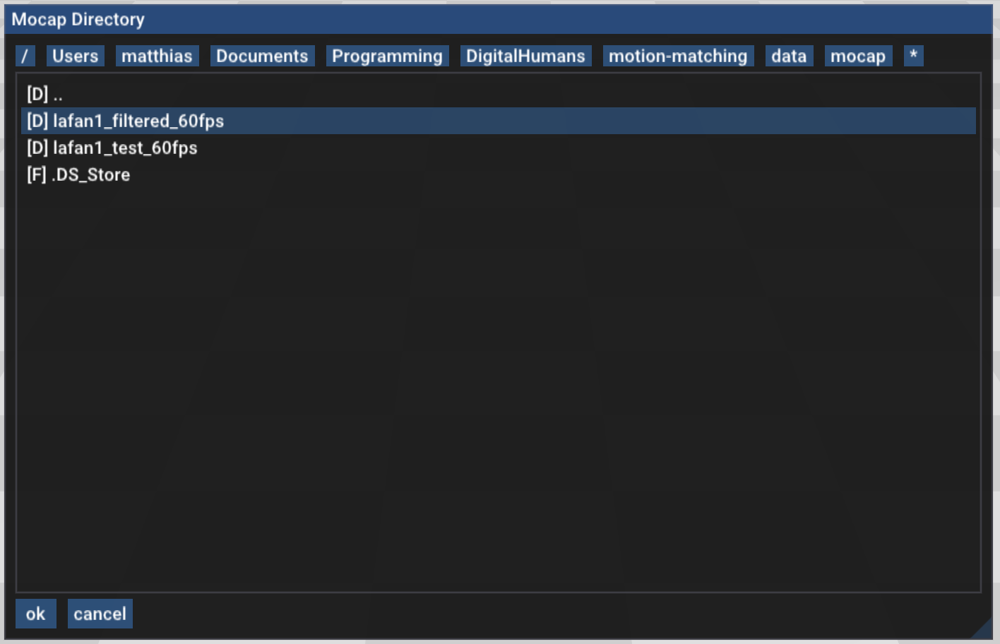
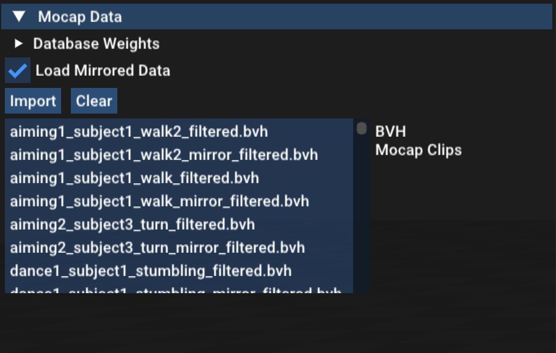

# Motion Matching for Responsive Animation For Digital Humans
For the course Digital Humans (2023 Spring) at ETH Zurich.

**Authors:**   
*Code base:* Dongho Kang  
*Motion Matching Implementation:* Matthias Karst, Xue Xian Lim, J. Pablo Paniagua H., Saatushan Sabesan

## How to use the program
1. The project `mocapApp` has to be build in cmake Release mode for realtime performance.

2. Run the `mocapApp`.

3. Click the `Main Menu > Mocap Data > Import` button, and navigate to the bvh mocap data
   directory `data/mocap/lafan1_filtered_60fps`.
   Select the folder to import all clips within the directory.

   

   Once the data was imported successfully, a list of the motion data clips will appear in the `Mocap Data` menu.

   

4. Click play or press the spacebar to start the motion matching controller.
   

## Controls
The character can be controlled either using a PlayStation 4 gamepad or with keyboard and mouse.
   
| Action      | Gamepad                  |  Keyboard & Mouse           |
| ----------- | ------------------------ | --------------------------- |
| Walking     | Left analog stick        | WASD                        |
| Camera      | Right analog stick       | Left Mousebutton + Drag     |
| Running     | Circle                   | Shift                       |
| Strafing    | L1                       | Alt/Option(Mac)             |

## UI
### Terrain Settings
Here one can activate uneven terrain.
### Drawing Options
These options decide what will be rendered to the screen. The 'Controller Trajectory' shows the trajectory of the user gamepad input, while the 'Animation Trajectory' shows the trajectory of the currently matched animation clip.
### Animation Player
The animation player allows to play animation clips from the mocap database. When the animation player box is checked a clip can be selected in the mocap data menu.
### Controller
The controller has multiple sliders to control the created gamepad trajectory. It also allows to change degree of synchronization between the gamepad and the animation.
### Motion Matching
The motion matching settings allow to change how often the motion matching algorithm is executed.
The database weights control the influence of the different features of the motion matching algorithm.
Importantly the database has to be rebuild to take the new weights into account.
The motion matching menu also allows to disable the inertialization and gives control over the desired blend time.
### Foot-Locking
The foot locking menu allows to enable or disable foot-locking. It also allows to change the unlocking threshold.
### Mocap Data
In the mocap data menu the bvh mocap data can be imported from a directory. It is possible to import only the original clips or loading the mirrored versions aswell to increase the database size.